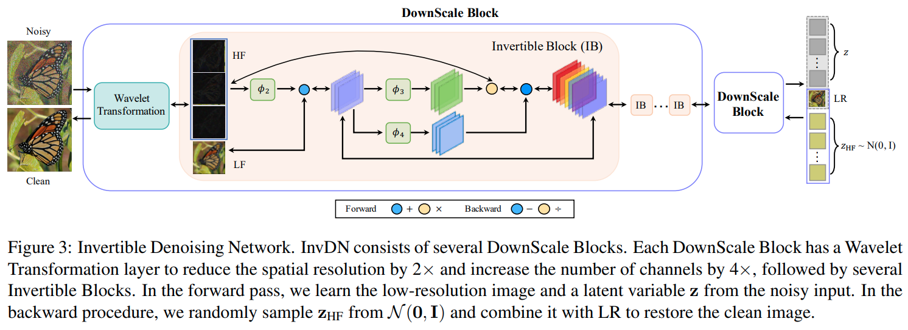
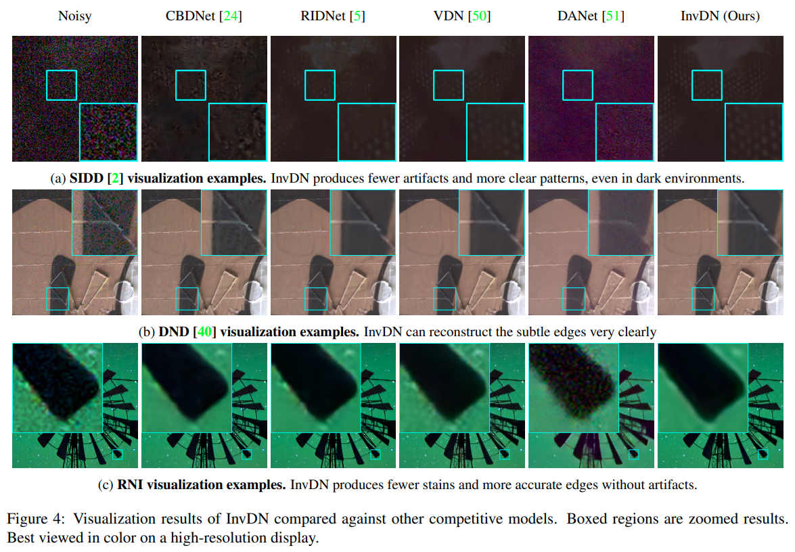

# Invertible Image Denoising
This is the PyTorch implementation of paper: Invertible Denoising Network: A Light Solution for Real Noise Removal (CVPR 2021). [arxiv](https://arxiv.org/pdf/2104.10546v1.pdf).

## Dependencies and Installation
- Python 3 (Recommend to use [Anaconda](https://www.anaconda.com/download/#linux))
- [PyTorch >= 1.0](https://pytorch.org/)
- NVIDIA GPU + [CUDA](https://developer.nvidia.com/cuda-downloads)
- Python packages: `pip install numpy opencv-python lmdb pyyaml`
- TensorBoard: 
  - PyTorch >= 1.1: `pip install tb-nightly future`
  - PyTorch == 1.0: `pip install tensorboardX`
  
## Dataset Preparation
The datasets used in this paper is DND (can be downloaded [here](https://noise.visinf.tu-darmstadt.de/)), SIDD (can be downloaded [here](https://www.eecs.yorku.ca/~kamel/sidd/)) and RNI.

## Get Started
Training and testing codes are in ['codes/'](./codes/). Please see ['codes/README.md'](./codes/README.md) for basic usages.
Pretrained model can be found in ['pretrained/'](./pretrained/)

## Invertible Architecture


## Visual Results

All visual results for SIDD dataset can be found in ['results/'](./results/).

## Acknowledgement
The code is based on [Invertible Image Rescaling](https://github.com/pkuxmq/Invertible-Image-Rescaling). 
If you find this code is helpful, please also cite the paper [Invertible Image Rescaling](https://arxiv.org/abs/2005.05650https://github.com/pkuxmq/Invertible-Image-Rescalinghttps://github.com/pkuxmq/Invertible-Image-Rescaling). 

## Citation
If you find this work helps you, please cite: 
```
@article{liu2021invertible,
  title={Invertible Denoising Network: A Light Solution for Real Noise Removal},
  author={Liu, Yang and Qin, Zhenyue and Anwar, Saeed and Ji, Pan and Kim, Dongwoo and Caldwell, Sabrina and Gedeon, Tom},
  journal={arXiv preprint arXiv:2104.10546},
  year={2021}
}
```

## Contact
If you have any questions, please contact <yang.liu3@anu.edu.au> or <zhenyue.qin@anu.edu.au>.
